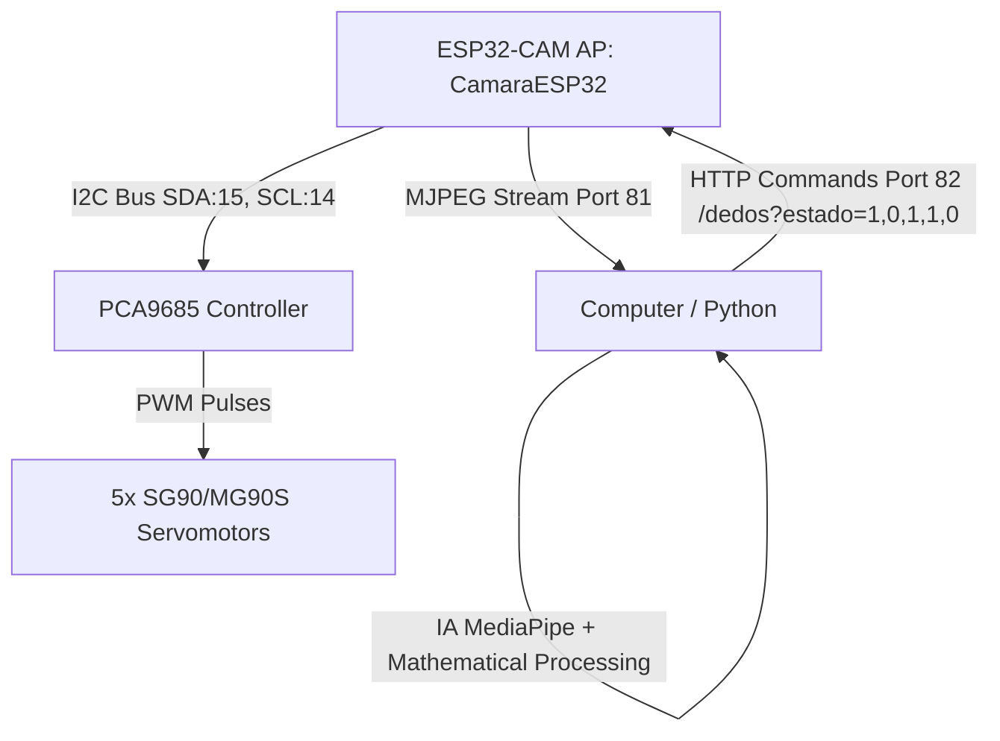

# Gesture-Controlled Robotic Hand via WiFi (ESP32-CAM + MediaPipe)

This project implements a high-speed wireless teleoperation system for a 5-finger robotic hand. The system uses real-time **Computer Vision** to detect a user's hand via an **ESP32-CAM** camera over WiFi, processes the movements using **MediaPipe** on the computer (PC), and sends the movement commands to the servomotors through a **PCA9685** controller connected via I2C to the ESP32.

The microcontroler is programmed natively in **C** using Espressif's official **ESP-IDF (Espressif IoT Development Framework)** with **FreeRTOS** (Real-Time Operating System) support, achieving far superior speed, stability, and efficiency compared to traditional Arduino IDE implementations.

---

## 🚀 System Architecture



### Key Features:
* **Ultra-Fast & Lag-Free Transmission**: Python uses a persistent background transmission thread with an optimized queue of size 1. This ensures the PC always sends the most recent state, completely eliminating network latency build-up over WiFi.
* **Hysteresis Jitter-Filter**: The Python script incorporates a state-memory algorithm to calculate the open/closed status of each finger using Euclidean distances. It avoids annoying servo jittering when the user's hand is partially closed.
* **Pause & Safe Exit System**:
  * Pressing the **Spacebar** on the PC pauses tracking and forces the robotic hand to open completely for safety.
  * Pressing **'q'** closes the program safely and sends a final command to fully open the robotic hand, preventing motors from remaining stuck under load.

---

## 🛠️ Hardware Requirements

1. **ESP32-CAM** (Standard AI-Thinker model).
2. **PCA9685 Controller** (16-channel PWM module over I2C).
3. **5 Servomotors** (SG90 or MG90S).
4. **External 5V Power Supply (Minimum 2A or 3A)** to power the servos (the ESP32-CAM cannot supply enough current for the motors).
5. **Common GND**: It is critical to connect the GND of the external 5V power supply with the GND of the ESP32-CAM and the PCA9685.
6. **FTDI Programmer / USB-to-TTL** to upload code to the ESP32-CAM.

---

## 🔌 Pin Connections

Make sure to hook up the components as follows:

| From (ESP32-CAM) | To (PCA9685) | Notes |
| :--- | :--- | :--- |
| **GPIO 15** | **SDA** | I2C Bus (Data) |
| **GPIO 14** | **SCL** | I2C Bus (Clock) |
| **5V / 3.3V** | **VCC** | Logic power supply for the PCA9685 chip |
| **GND** | **GND** | Logic common ground |

| From (External 5V Power Supply) | To (PCA9685 - Green Terminal Block) | Notes |
| :--- | :--- | :--- |
| **V+ / 5V** | **V+ (Green terminal)** | Servo power supply |
| **GND** | **GND (Green terminal)** | Power ground. **Must be joined with ESP32-CAM GND** |

### Servomotor Channels on PCA9685:
* **Channel 0**: Thumb
* **Channel 1**: Index
* **Channel 2**: Middle
* **Channel 3**: Ring
* **Channel 4**: Pinky

---

## 🖨️ 3D Printing & Mechanical Models

The project includes all the necessary STL files to print the physical structure of the robotic hand. You can find them in the [3D Files Robo Hand/](./3D%20Files%20Robo%20Hand) directory:

* **Fingers**: Individual models for the Thumb (`Finger_Thumb.stl`), Index (`Finger_Index.stl`), Middle (`Finger_Middle.stl`), Ring (`Finger_Ring.stl`), and Pinky (`Finger_Pinky.stl`).
* **Hand Bases**: Choice of Left Hand (`Left_Hand.stl`) or Right Hand (`Right_Hand.stl`).
* **Arm Structure**: Main Arm mount (`Arm.stl`) and its cover (`Arm_Cover.stl`) to secure the micro-servos and the PCA9685 controller.

*Recommended print settings:*
* Material: PLA or PETG.
* Infill: 20% to 30% for durability.
* Support: Enabled for finger joints and hand cavities.

---

## 💻 ESP32-CAM Setup and Flashing (ESP-IDF)

The project includes the `espressif/` folder configured as a native ESP-IDF project.

### Option 1: Using VS Code Extension (Recommended)
1. Install the **Espressif IDF** extension in VS Code.
2. Configure the extension (`Ctrl+Shift+P` -> `ESP-IDF: Configure ESP-IDF Extension` -> select **Express**).
3. Open the `espressif/` folder in VS Code.
4. Connect your ESP32-CAM in flashing mode (connect GPIO 0 to GND before booting) via your USB-TTL programmer.
5. Select the corresponding COM port and `ESP32` chip in the bottom bar.
6. Press the **Build** 🔨 button and then **Flash** ⚡.
7. Disconnect GPIO 0 from GND and reboot the module.

### Option 2: Using the ESP-IDF Command Line
Open your ESP-IDF command prompt (with the environment exported) and run:
```bash
# Navigate to directory
cd espressif

# Build the project
idf.py build

# Flash to the ESP32 (replace COM4 with your port)
idf.py -p COM4 flash

# Monitor live logs
idf.py -p COM4 monitor
```

*Note: The `sdkconfig` file is already pre-configured and optimized with PSRAM support and the correct camera CPU frequency for the ESP32-CAM board.*

---

## 🐍 PC Setup and Running (Python)

### 1. Prepare a Virtual Environment
In the root directory, open a terminal and create a virtual environment:
```bash
# Create environment
python -m venv .venv

# Activate on Windows (PowerShell)
.venv\Scripts\Activate.ps1

# Activate on Linux/macOS
source .venv/bin/activate
```

### 2. Install Dependencies
Install the required libraries:
```bash
pip install -r requirements.txt
```

### 3. Run the Controller
Connect your PC to the WiFi network generated by the ESP32-CAM:
* **SSID**: `CamaraESP32`
* **Password**: `12345678`

Once connected, run the main script:
```bash
python mano_robotica_wifi_camara.py
```

*Note: The first time you run the script, it will **automatically download** the lightweight MediaPipe model (`hand_landmarker.task`) from the official Google servers and save it locally, so no manual downloading is necessary.*

---

## 🎮 In-App Controls
* **Spacebar**: Pause / Resume sending movements. For safety, the robotic hand will fully open when paused.
* **'q' key**: Safely closes the stream window, sends a final open command to the hand, and exits the script.
